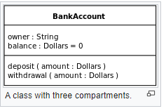
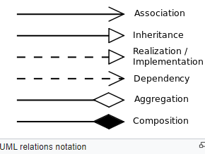
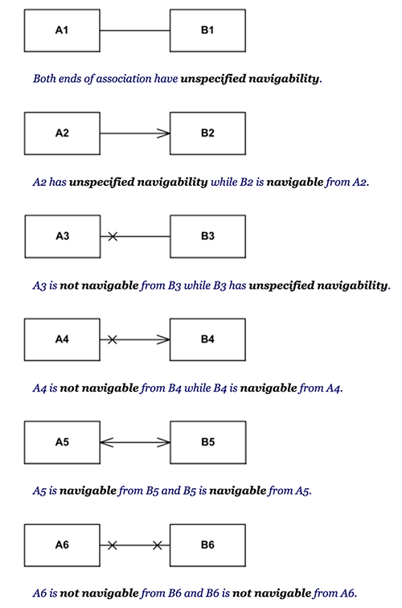
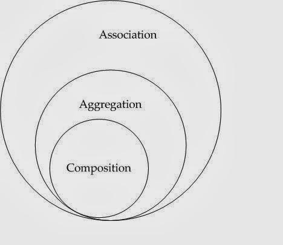

<!--
.. title: UML
.. slug: uml
.. date: 2020-01-25 13:26:02 UTC-08:00
.. tags: 
.. category: 
.. link: 
.. description: 
.. type: text
-->

- Unified modeling language (UML) is a way of visualizing a software program using a collection of diagrams
- In software engineering, a class diagram in the Unified Modeling Language (UML) is a type of static structure diagram that describes the structure of a system by showing the system's classes, their attributes, operations (or methods), and the relationships among objects.

### Class Diagram:  
<!-- -           -->
  

- displayed as rectangles divided into (horizontal) compartments
    - 1st compartment = name of class
    - 2nd compartment = attributes
    - 3rd compartment = operations
    - To specify the visibility of a class member (i.e. any attribute or method), these notations must be placed before the member's name:
        - \+ Public
        - \- Private
        - \# Protected
        - ~ Package
### Relationships
  
#### Dependency
- typically (but not always) implies that an object accepts another object as a method parameter, instantiates, or uses another object. A dependency is very much implied by an association.
- To quote from the 3rd edition of UML Distilled (now just out) "a dependency exists between two elements if changes to the definition of one element (the supplier) may cause changes to the other (the client)". (https://martinfowler.com/bliki/DependencyAndAssociation.html)
    - You don't want to show every dependency on a UML diagram. There are far too many. You need to be very selective and show only those that are important to whatever it is you are communicating. (https://martinfowler.com/bliki/DependencyAndAssociation.html)
#### Association
- almost always implies that one object has the other object as a field/property/attribute (terminology differs).
- arrows describe navigability
    - if B is navigable from A (usually meaning A has B as an attribute) then the arrow will point at B (see 2nd example below).
  

- association types:
    - bi-directional
        - associations assumed to be bi-directional
    - uni-directional
        - In a unidirectional association, two classes are related, but only one class knows that the relationship exists.
    - aggregation
        - "has a" relationship
        - e.g. class and student, company and people
        - composition
            - "is part of"
            - "owns"
            - the composed (contained) object cannot exist without the other entity (container)
            - e.g. company and accounts  
  

        - In Aggregation (that is not composition), both the entries can survive individually which means ending one entity will not effect the other entity
    - reflexive - objects of same class related to each other
#### Realization
- a specialized abstraction relationship between two sets of model elements, one representing a specification (the supplier) and the other represents an implementation of the latter (the client)
- interface realization - relationship between a classifier and an interface where classifier conforms to the interface (e.g. adapter pattern)

